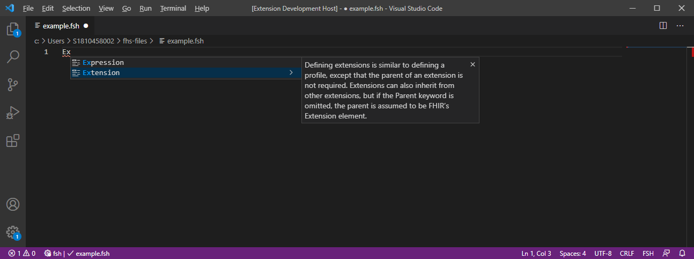
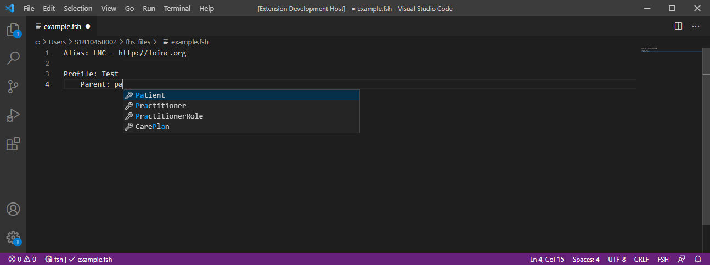

# FSH-language-server

The FSH-language-server is a languageserver implementation for 
[HL7® FHIR® Shorthand](http://hl7.org/fhir/uv/shorthand/STU1/) 
and implements the [language server protocol](https://microsoft.github.io/language-server-protocol/).
It can be used with any editor, if the editor implements a client for this language server. The base structure leaned on the [camel-language-server](https://github.com/camel-tooling/camel-language-server/tree/master).

## Clients
Right now there is no functioning client, but there is one in work [VS Code](https://github.com/FHOOEAIST/Itamae).

## Features

###Code completion
* Entity names and metadata

* Completion support for rules
    * possible keywords for different rules

    * path definition support for entities with contains rule

* Completion support for metadata 
    * InstanceOf
    * Parent
    * Source

## FAQ

If you have any questions, please checkout our [FAQ](https://fhooeaist.github.io/seshat/faq.html) section.

## Contributing

**First make sure to read our [general contribution guidelines](https://fhooeaist.github.io/CONTRIBUTING.html).**
   
## Licence

Copyright (c) 2020 the original author or authors.
DO NOT ALTER OR REMOVE COPYRIGHT NOTICES.

This Source Code Form is subject to the terms of the Mozilla Public
License, v. 2.0. If a copy of the MPL was not distributed with this
file, You can obtain one at https://mozilla.org/MPL/2.0/.

## Research

If you are going to use this project as part of a research paper, we would ask you to reference this project by citing
it. 

<TODO zenodo doi>
