# FSH-language-server

The FSH-language-server is a languageserver implementation for
[HL7® FHIR® Shorthand](http://hl7.org/fhir/uv/shorthand/STU1/)
and implements the [language server protocol](https://microsoft.github.io/language-server-protocol/).
It can be used with any editor, if the editor implements a client for this language server. The base structure leaned on the [camel-language-server](https://github.com/camel-tooling/camel-language-server/tree/master).

## Clients
Right now there is no functioning client, but there is one in work [VS Code](https://github.com/FHOOEAIST/Itamae).

## Features

**Code completion**
* Entity names and metadata
  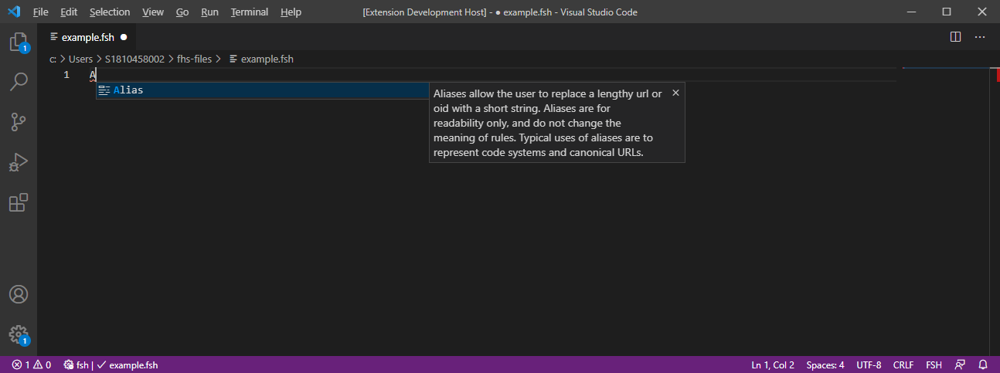
  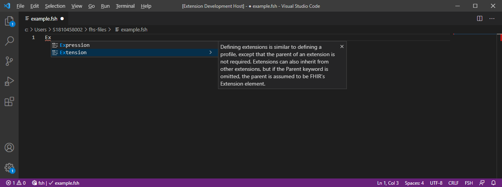
  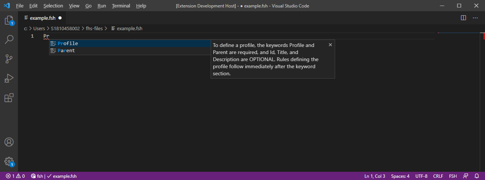
* Completion support for different rules
    * value set rule
      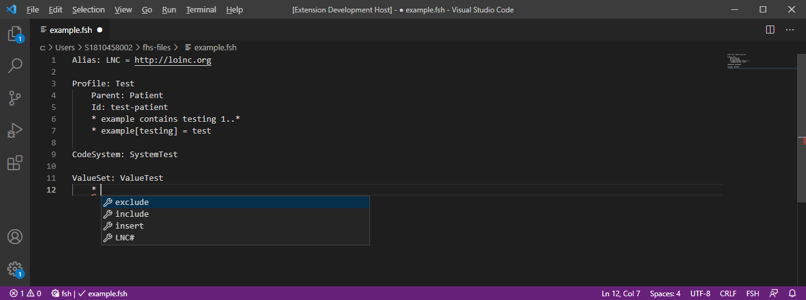
      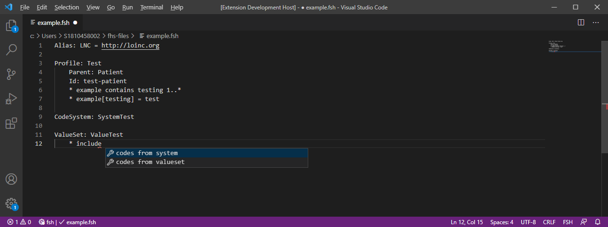
      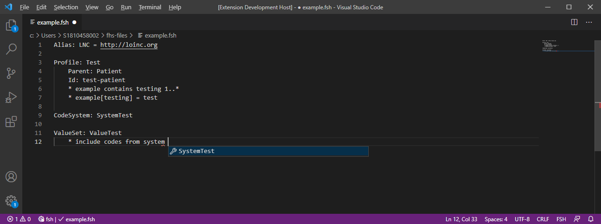
    * path definition support for entities with contains rule
      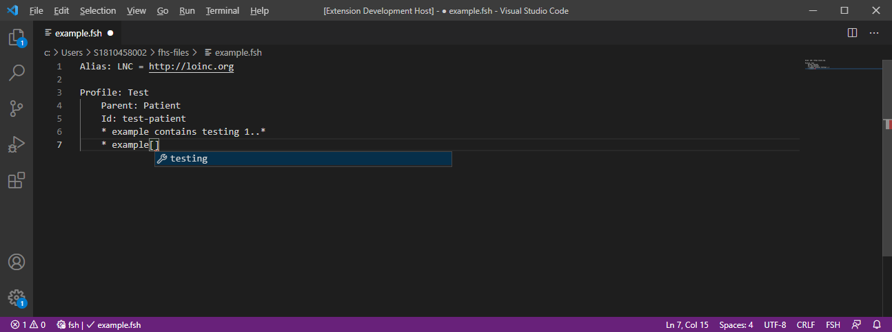
* Completion support for metadata
    * InstanceOf
    * Source
    * Parent
      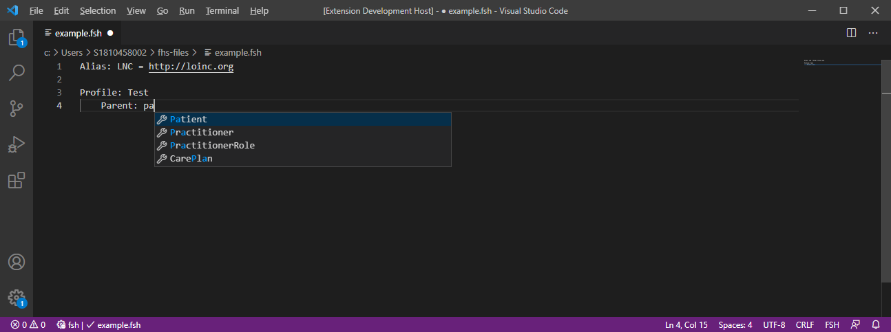
      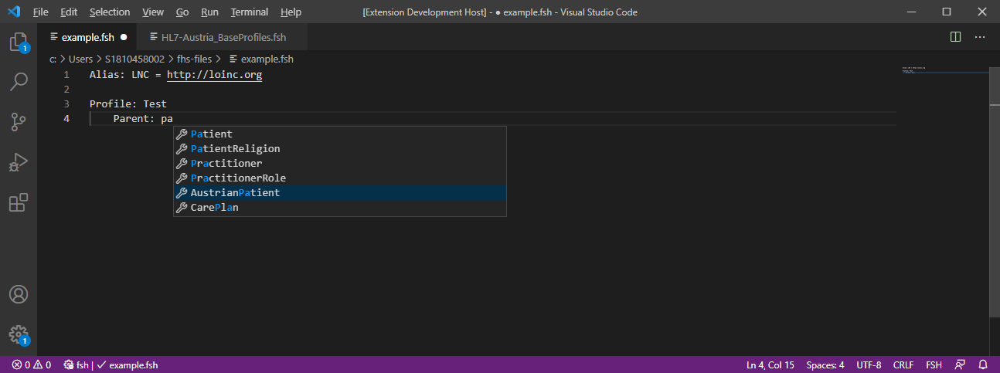

**Syntax checking**
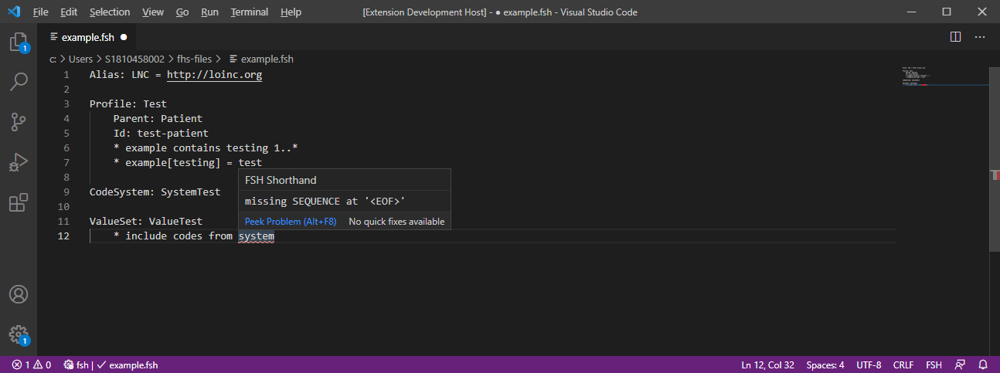
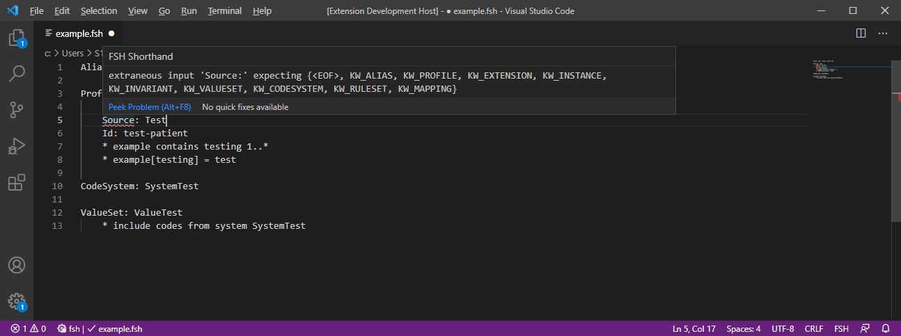
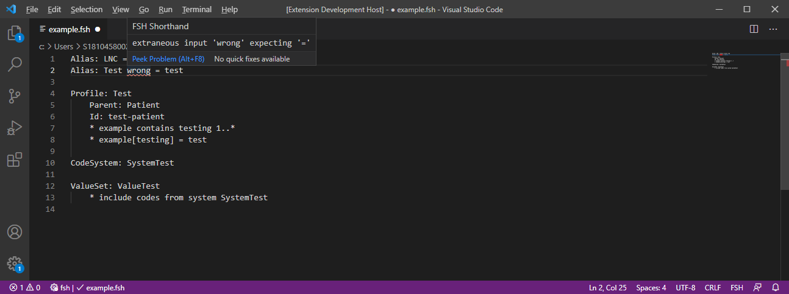

**Goto code** \
Goto Definition
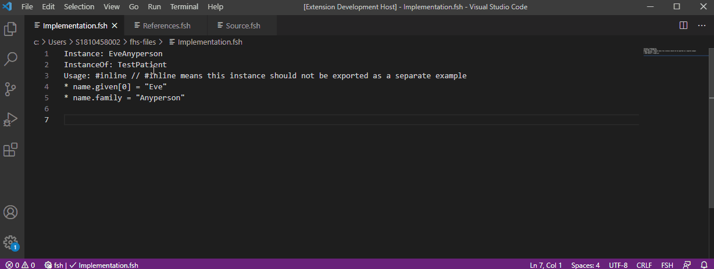 \
\
Goto Implementation
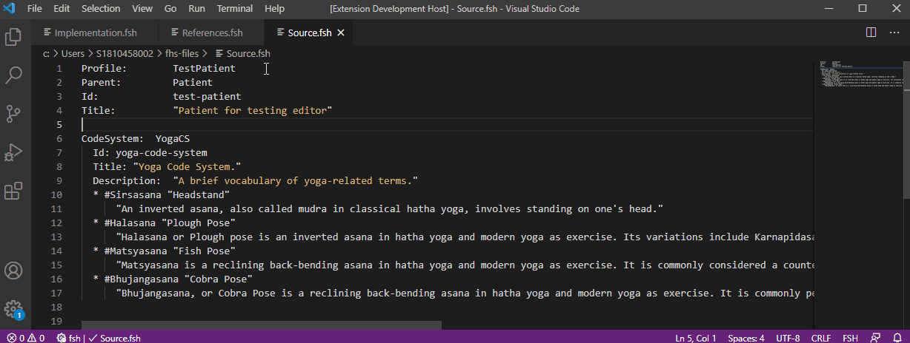\
\
Goto References
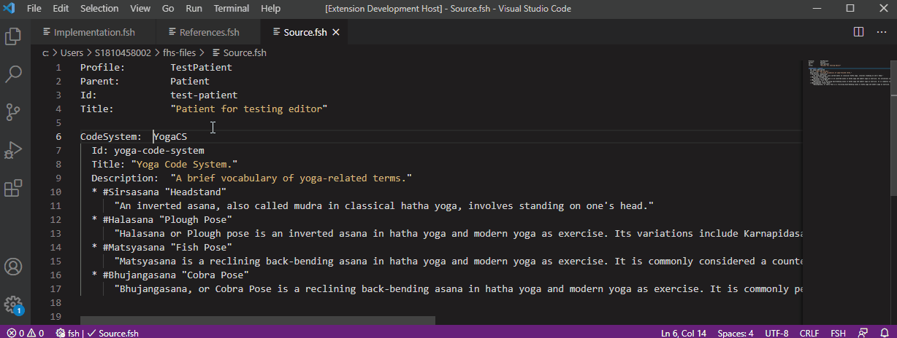

**Hover information**
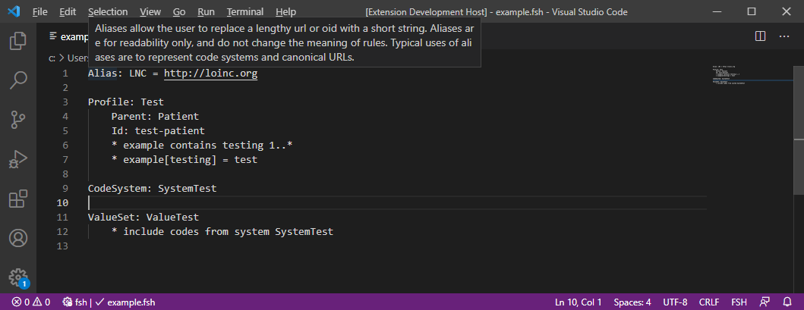
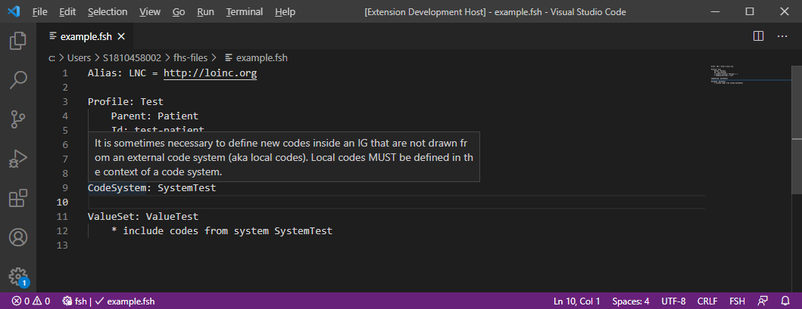
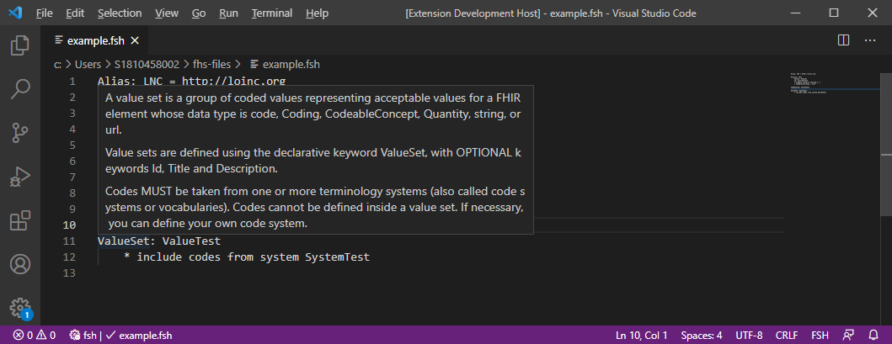

**Rename**
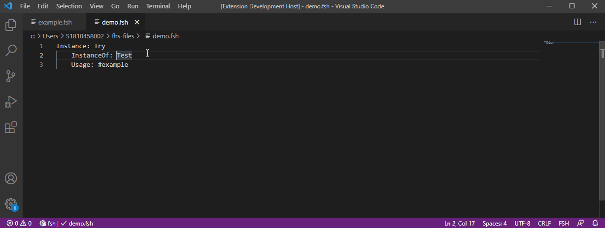
If the renaming entity is the last word, renaming won't work.

**Formatting** \
All examples are from [FSH language reference](https://build.fhir.org/ig/HL7/fhir-shorthand/reference.html).
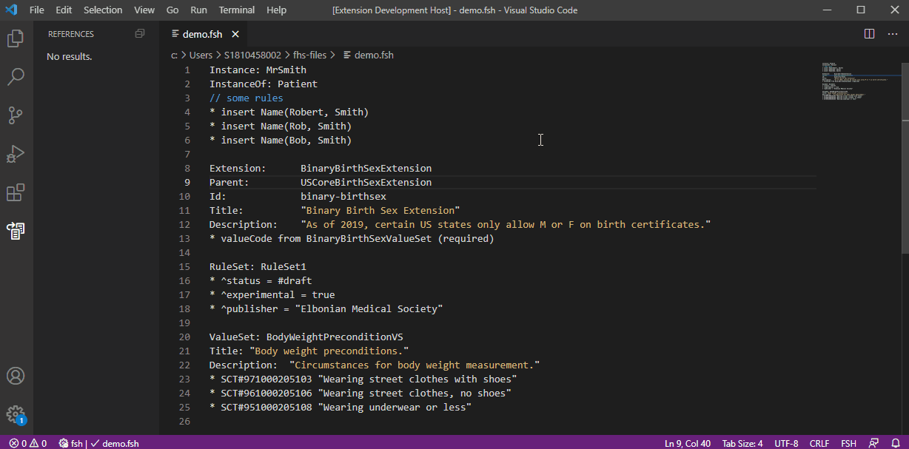

## Contributing

**First make sure to read our [general contribution guidelines](https://fhooeaist.github.io/CONTRIBUTING.html).**

## Licence

Copyright (c) 2021 the original author or authors.
DO NOT ALTER OR REMOVE COPYRIGHT NOTICES.

This Source Code Form is subject to the terms of the Mozilla Public
License, v. 2.0. If a copy of the MPL was not distributed with this
file, You can obtain one at https://mozilla.org/MPL/2.0/.

## Research

If you are going to use this project as part of a research paper, we would ask you to reference this project by citing
it.
